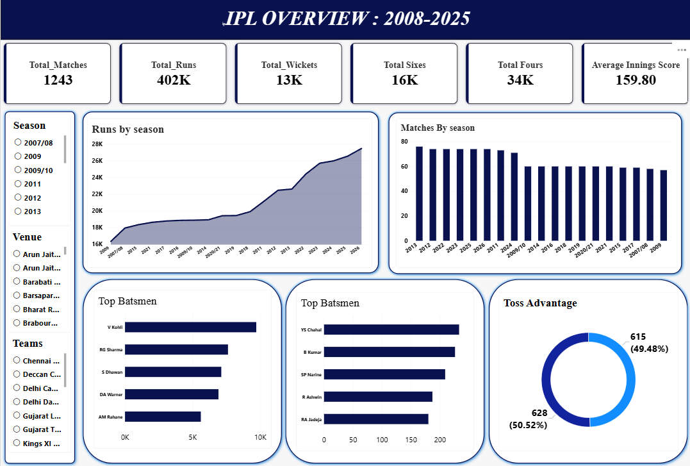
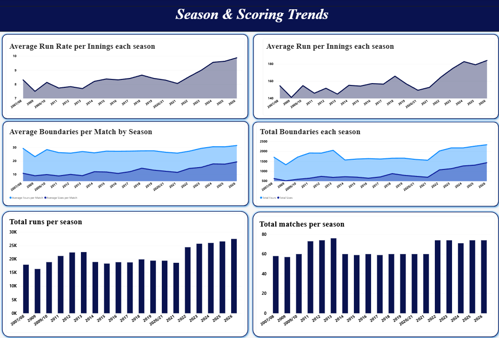
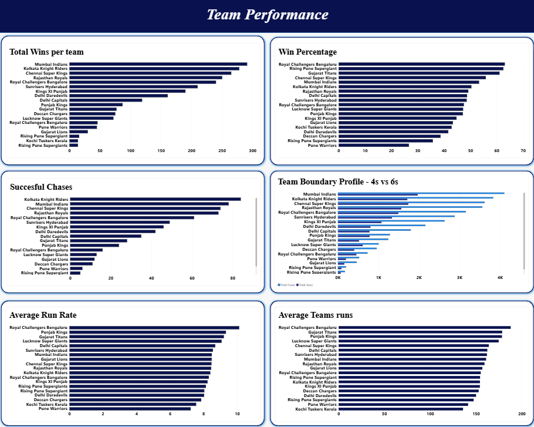
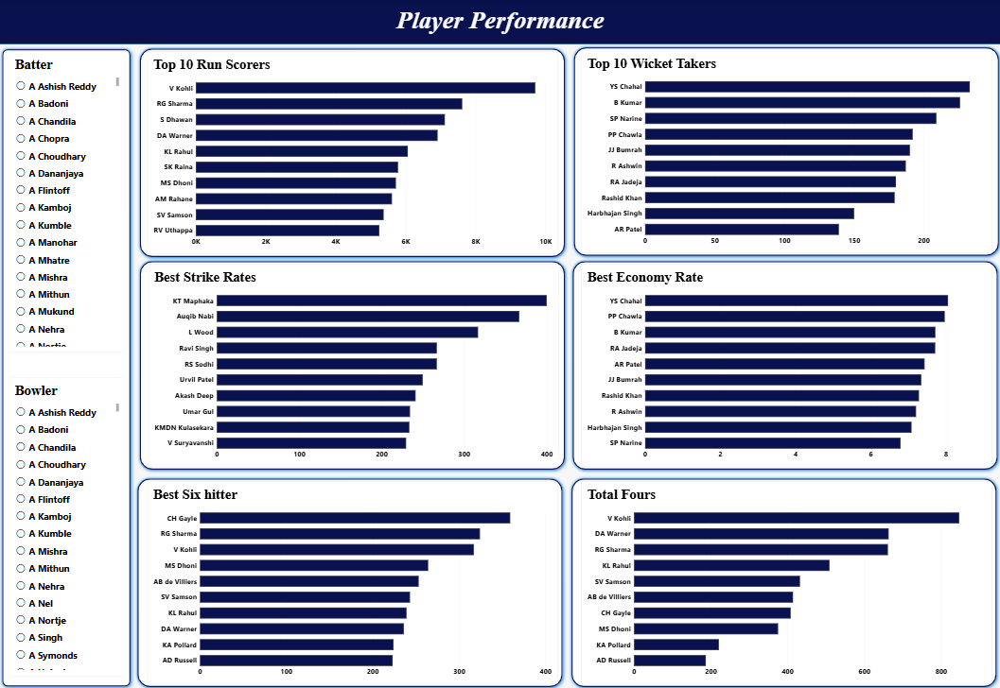
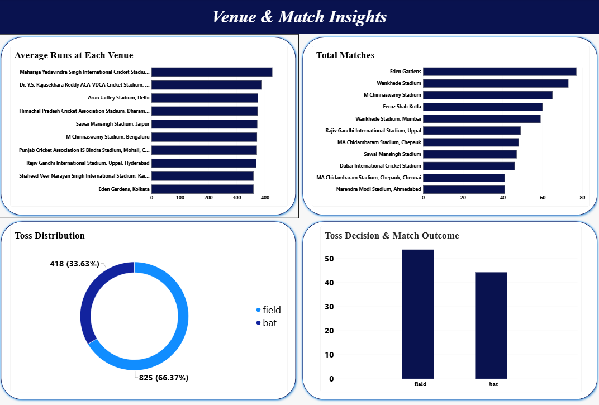

# 🏏 IPL Data Analytics: PostgreSQL + Power BI

An end-to-end IPL data analytics project using **Python, Pandas, PostgreSQL, SQL and Power BI** to analyse season-wise scoring trends, team performance, player statistics, venue insights and match outcomes through an interactive five-page dashboard.


---

## 📑 Table of Contents

1. [Project Overview](#-project-overview)
2. [Key Highlights](#-key-highlights)
3. [Workflow](#-workflow)
4. [Dataset](#-dataset)
5. [Dashboard Preview](#-dashboard-preview)
6. [SQL Analysis](#-sql-analysis)
7. [Key Findings](#-key-findings)
8. [Repository Structure](#-repository-structure)
9. [How to Use](#-how-to-use)
10. [Limitations](#-limitations)
11. [Future Scope](#-future-scope)
12. [Author](#-author)
13. [License](#-license)

---

## 📌 Project Overview

The Indian Premier League (IPL) produces detailed ball-by-ball data. Raw records alone make it hard to see long-term patterns, so this project organises, queries and visualises that data to answer questions such as:

- How have scoring patterns changed across seasons?
- Which teams have the strongest batting performances?
- Which players lead in runs, wickets, sixes and fours?
- Which venues are the most batting-friendly?
- Does winning the toss improve the chance of winning?

PostgreSQL is used for structured analysis (ten analytical queries), and Power BI turns the results into an interactive dashboard with KPI cards, charts and slicers.

## ✨ Key Highlights

- **1,243 matches** analysed from ball-by-ball data
- **~402K runs**, **~13K wickets**, **~16K sixes** and **~34K fours** across the dataset
- **10 SQL queries** using CTEs, `GROUP BY`, `FILTER`, `HAVING`, `CASE` and `STDDEV`
- **5-page interactive Power BI dashboard** with season, venue, team, batter and bowler slicers
- A full **project report (PDF)** documenting the methodology, results and limitations

## 🔄 Workflow

```text
IPL Dataset → Python/Pandas Cleaning → PostgreSQL (ipl_data) → SQL Analytics → Power BI Dashboard → Insights & Reporting
```

| Stage | Description |
|---|---|
| **1. Load & inspect** | Read the dataset with Pandas; check shape, data types, missing values and duplicates |
| **2. Clean** | Remove duplicates, standardise column names, trim text, fix date and numeric types |
| **3. Store** | Load the cleaned data into the PostgreSQL table `ipl_data` |
| **4. Analyse** | Run ten analytical SQL queries (see [SQL Analysis](#-sql-analysis)) |
| **5. Visualise** | Build the five-page Power BI dashboard |

## 🗂 Dataset

Ball-by-ball IPL data, stored in the table `ipl_data`. Key fields:

| Field | Description |
|---|---|
| `match_id` | Identifier grouping deliveries into a match |
| `season` | IPL season |
| `innings`, `over` | Innings number and over number |
| `batter`, `bowler` | Players involved in a delivery |
| `batting_team`, `bowling_team` | Teams involved in a delivery |
| `runs_batter`, `runs_total` | Runs credited to the batter / total runs on the delivery |
| `valid_ball`, `bowler_wicket` | Legal-delivery and bowler-wicket indicators |
| `venue` | Match venue |
| `toss_winner`, `toss_decision` | Toss winner and their decision (bat or field) |
| `match_won_by`, `win_outcome` | Match winner and winning margin |

> **Season coverage:** the season labels in the data run from `2007/08` to `2026` (including `2009/10` and `2020/21`). Update this note if you filter the data to a specific range.

## 📊 Dashboard Preview

The Power BI report (`Ipl dashboard.pbix`) has five pages.

### Page 1 · IPL Overview
Six KPI cards (Total Matches, Runs, Wickets, Sixes, Fours, Average Innings Score), runs and matches by season, top run scorers, top wicket takers, a toss-advantage donut chart, and season / venue / team slicers.



### Page 2 · Season & Scoring Trends
Average run rate, average runs per innings, boundaries per match, total boundaries, total runs and total matches by season.



### Page 3 · Team Performance
Total wins, win percentage, successful chases, 4s vs 6s boundary profile, average run rate and average team runs.



### Page 4 · Player Performance
Top 10 run scorers and wicket takers, strike rates, economy rates, six hitters and four hitters, with batter and bowler slicers.



### Page 5 · Venue & Match Insights
Average runs and total matches by venue, toss distribution, and toss decision versus match outcome.



## 🧮 SQL Analysis

All queries are in [`analysis.sql`](analysis.sql) and run against the `ipl_data` table. Minimum-sample filters (for example at least 20 innings, 10 matches or 500 legal balls) keep rankings from being driven by tiny samples.

| # | Question | Main metrics |
|---|---|---|
| 1 | How has IPL scoring changed across seasons? | Average innings score, run rate, matches |
| 2 | Which teams are most consistent at scoring? | Average score, standard deviation, min / max |
| 3 | Which teams chase most successfully? | Chases, successful chases, success rate |
| 4 | Does winning the toss improve the chance of winning? | Toss-winner wins, toss-win % |
| 5 | Which teams score fastest in the Powerplay? | Average Powerplay runs, run rate |
| 6 | Which teams accelerate most from Powerplay to death overs? | Powerplay vs death-over run rate |
| 7 | Which batters have the best strike rate (min. 500 balls)? | Runs, balls, strike rate |
| 8 | Which bowlers create the most dot-ball pressure? | Legal balls, dot balls, dot-ball % |
| 9 | Which venues are most batting-friendly? | Average match runs, score variation |
| 10 | Which teams have the strongest overall batting profile? | Runs per match, fours, sixes, dot-ball % |

<details>
<summary><b>Example query: Toss advantage (Q4)</b></summary>

```sql
WITH match_results AS (
    SELECT DISTINCT match_id, toss_winner, match_won_by
    FROM ipl_data
    WHERE toss_winner IS NOT NULL
      AND match_won_by IS NOT NULL
)
SELECT
    COUNT(*) AS total_matches,
    COUNT(*) FILTER (WHERE toss_winner = match_won_by) AS toss_winner_wins,
    ROUND(COUNT(*) FILTER (WHERE toss_winner = match_won_by) * 100.0 / COUNT(*), 2) AS toss_win_percentage
FROM match_results;
```

**Result:** 1,243 matches · 628 toss-winner wins · **50.52%**

</details>

## 🔍 Key Findings

- **Scoring has risen sharply.** The average innings score rose from about 141 (2009) to about 185 (2026), and the run rate from about 7.5 to about 9.9 per over, with the steepest growth from 2022.
- **Boundaries drive the change.** Average sixes per match roughly doubled, from about 9-10 in early seasons to about 19 in the latest.
- **Royal Challengers Bengaluru lead on batting averages.** They average 187.83 per innings, the highest Powerplay run rate (9.99) and the lowest dot-ball percentage (30.72%), though from a smaller sample of innings.
- **The toss is not decisive.** Toss winners won only 50.52% of matches (628 of 1,243).
- **Venues differ.** Arun Jaitley Stadium (Delhi), Dharamsala and Jaipur average over 370 runs per match.
- **Dot-ball pressure.** DW Steyn leads with 46.70% dot balls (2,182 legal balls).
- **Fastest strike rates (min. 500 balls).** TH David (179.28), AD Russell (176.06), PD Salt (175.94).

## 📁 Repository Structure

```text
IPL-Data-Analytics-PowerBI/
├── assets/                                  # Dashboard screenshots used in this README
│   ├── page1.png
│   ├── page2.png
│   ├── page3.png
│   ├── page4.png
│   └── page5.png
├── analysis.sql                             # Ten PostgreSQL analytical queries
├── app.py                                   # Python script for the project
├── Ipl dashboard.pbix                       # Power BI report (source file)
├── Ipl dashboard.pdf                        # Exported dashboard (5 pages)
├── IPL ANALYTICS USING POSTGRESQL.pdf       # SQL queries with result screenshots
├── IPL_Data_Analytics_Project_Report.pdf    # Full project report
├── .gitignore
├── LICENSE                                  # MIT License
└── README.md
```

## 🚀 How to Use

**Prerequisites:** Python 3.x, Pandas, PostgreSQL, Power BI Desktop.

1. **Clone the repository**
   ```bash
   git clone https://github.com/aayush45123/IPL-Data-Analytics-PowerBI.git
   cd IPL-Data-Analytics-PowerBI
   ```
2. **Prepare the data** with Pandas (clean and export the ball-by-ball dataset).
3. **Load it into PostgreSQL** as a table named `ipl_data`.
4. **Run the queries** in `analysis.sql` using pgAdmin or `psql`.
5. **Open the dashboard:** open `Ipl dashboard.pbix` in Power BI Desktop and refresh the data source if needed.

> The raw dataset is not included in this repository. Add your own copy of the IPL ball-by-ball data before running the steps above.

## ⚠️ Limitations

- Team names appear in more than one form (for example Royal Challengers Bangalore/Bengaluru, Delhi Daredevils/Capitals, Kings XI Punjab/Punjab Kings), which splits their statistics.
- Venue names also vary (for example Wankhede Stadium and Wankhede Stadium, Mumbai).
- Some dashboard rankings (such as strike rate and economy rate) do not apply a minimum-balls filter, so small samples can distort them. The SQL queries do apply one.
- Historical comparisons are affected by changes in the number of teams and matches per season.
- A toss decision or win margin alone does not establish causation.

## 🔭 Future Scope

- Standardise team and venue names across seasons
- Apply minimum-sample filters to the strike-rate and economy visuals
- Add match-level drill-through pages and win-margin analysis
- Compare batting and bowling performance by match phase
- Publish the report to Power BI Service

## 👤 Author

**Aayush Bharda**
Department of Artificial Intelligence and Data Science
K J Somaiya Institute of Technology

GitHub: [@aayush45123](https://github.com/aayush45123)

## 📄 License

This project is licensed under the [MIT License](LICENSE).
